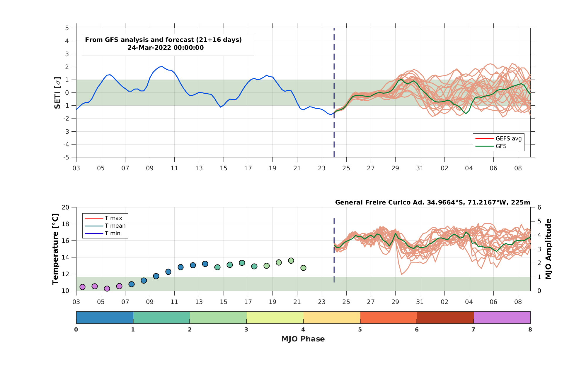
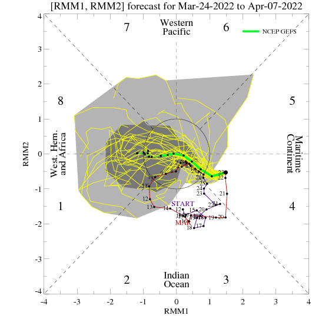

****
Repositorios de datos
****

.. Repositorios: interno:

Repositorio interno
==== 

El directorio ``ETI`` contiene una serie de subdirectorios, rutinas y scripts que generan un pronóstico diario del índice sETI. 

   Figura: Índice sETI (panel superior)

A continuación, se detallan los archivos y directorios más importantes: ::

  hw_dynamic
  ├── ETI
      ├── run.csh
      ├── runSETI.csh
      ├── data
      ├── figures
      ├── logfiles
      ├── output
      ├── scripts
          ├── get_GFS_ana.sh
          ├── get_GFS_eavg.sh
          ├── get_GFS_ens.sh
          ├── get_GFS_ens_temp.sh
          ├── get_GFS_oper.sh
          ├── get_GFS_oper_temp.sh
          ├── recoverSETI.sh
          └── sETI.m
      ├── tmp
      └── upload
      
``run.csh``: Este script está programado en crontab para ejecutarse diariamente. En él se definen algunas variables que luego son utilizadas en ``runSETI.csh``. 

``runSETI.csh``: Este es el script principal donde se genera el índice sETI. Dentro de él se ejecutan una serie de otros scripts secundarios. 

``data/``: Aquí se guardan los archivos utilizados en la generación del índice. 

``figures/``: Este es el repositorio de figuras generadas. 

``logfiles/``: En este directorio se guarda un archivo de cada ejecución de ``run.csh``. Si por algún motivo la figura del día no se genera, en este archivo se pueden revisar los errores de la ejecución. 

``output/``: Aquí se guardan todos los archivos generados durante la ejecución del día. 

``scripts/``: En este directorio se encuentran todos los scripts utilizados en la generación del índice sETI.

``tmp/``: Directorio para almacenar las descargas temporales de archivos antes de ser procesados.  

``upload/``: Aquí se guardan una serie de figuras actualizadas utilizadas en `hw-monitor <https://www2.dgeo.udec.cl/shiny/hw-monitor/>`_.

``seti.m``:  Este script en ``MATLAB`` produce la figura del índice sETI. 

.. warning::
   
   Antes de ejecutar ``run.csh`` se deben cambiar algunas direcciones en los siguientes scripts para adecuarlas a la configuración propia. 

1) run.csh 

.. code:: bash

  set diri=/home/matlab/hw_dynamic

2) runSETI.csh 

.. code:: bash

  set diri=/home/matlab/hw_dynamic
  /usr/local/bin/ncdump -v lat temp.nc | sed -e '1,/data:/d' -e '$d' >& latitudes.log
  /usr/local/bin/matlab -nodisplay -nosplash -nodesktop < sETI.m
  
Estos scripts y directorios desempeñan un papel fundamental en la generación del índice sETI, y se deben configurar adecuadamente antes de su ejecución para asegurar el correcto funcionamiento de la aplicación.  

Repositorios externos
====

Los repositorios externos ``JMA``, ``mjo_repo`` y ``SERVIMET`` almacenan figuras descargadas mediante un script simple programado para ejecutarse una vez al día (3 veces en el caso de ``SERVIMET``). ::

  hw_dynamic
  ├── JMA
      └── jma_repo.csh
  ├── mjo_repo
      ├── bom
          ├── RMM_40_days
          └── RMM_90_days
      ├── ncpe
      └── mjo_repo.csh
  └── SERVIMET
      ├── cartas_color
      └── servimet.csh
      
.. warning::

  Es importante tener en cuenta que se deben realizar modificaciones en las siguientes líneas de los scripts para adaptarlos a la configuración propia de su sistema.

1. jma_repo.csh

.. code:: bash
  
  cd /home/matlab/hw_dynamic/JMA
  
2. mjo_repo.csh

.. code:: bash

  cd /home/matlab/hw_dynamic/mjo_repo
  
3. servimet.csh

.. code:: bash

  cd /home/matlab/hw_dynamic/SERVIMET

JMA
----

.. figure:: images/main3.gif
   :width: 75%
   :align: center
   :alt: GitHub template for the tutorial

   Figura: OLR y función corriente de 200 hPa y el flujo de actividad de onda (anomalía) emitido por la Agencia Meteorológica de Japón (JMA)

mjo_repo
----

   Figura: Pronóstico basado en MJO GFS emitido por el Centro de Predicción Climática de la NOAA de EE. UU

SERVIMET
----

.. figure:: images/main5.jpeg
   :width: 75%
   :align: center
   :alt: GitHub template for the tutorial

   Figura: Cartas sinóptica emitida por el Servicio Meteorológico de la Armada de Chile (SERVIMET)
