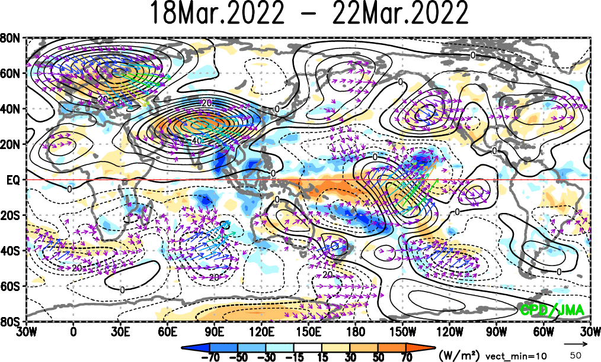
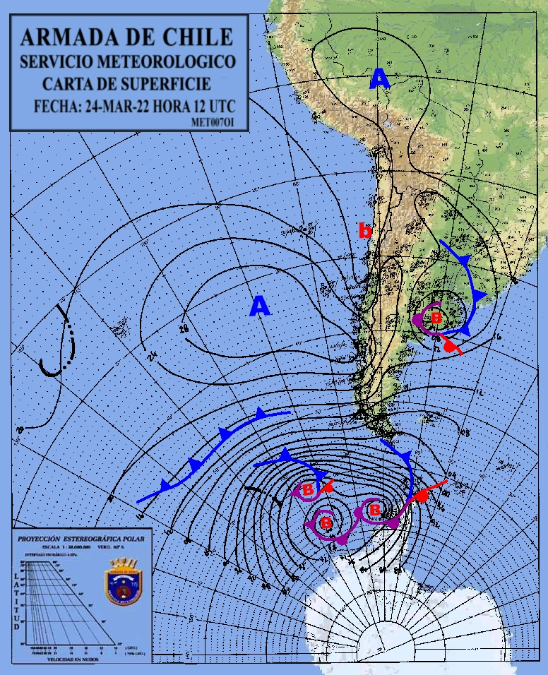

****
Repositorios: externos
****

.. Repositorios: externos:

JMA, mjo_repo y SERVIMET almacenan figuras descargadas mediante un script simple programado para ejecutarse una vez al día (3 veces en el caso de SERVIMET). En estos scripts hay que modificar las direcciones. ::

  hw_dynamic
  ├── JMA
      └── jma_repo.csh
  ├── mjo_repo
      ├── bom
          ├── RMM_40_days
          └── RMM_90_days
      ├── ncpe
      └── mjo_repo.csh
  └── SERVIMET
      ├── cartas_color
      └── servimet.csh

JMA
====

   OLR y función corriente de 200 hPa y el flujo de actividad de onda (anomalía) emitido por la Agencia Meteorológica de Japón (JMA)

mjo_repo
====

.. figure:: images/main4.gifg
   :width: 100%
   :align: center
   :alt: GitHub template for the tutorial

   Pronóstico basado en MJO GFS emitido por el Centro de Predicción Climática de la NOAA de EE. UU

SERVIMET
====

   Cartas sinóptica emitida por el Servicio Meteorológico de la Armada de Chile (SERVIMET)
